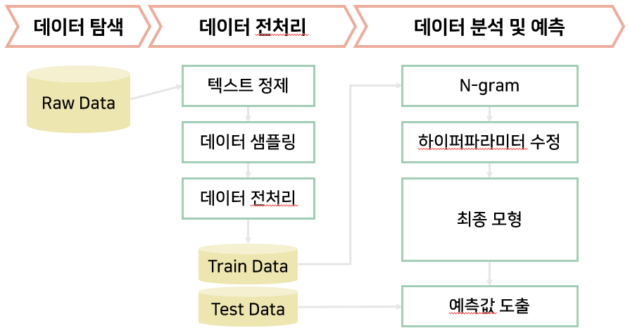

# Dacon 14회 KB 금융문자 분석 모델링 경진대회
## euphoria , 2020.01.17

~~~
Subtitle: Predict smishing from text message
Tags: #finance #text #nlp #textanalysis
Period: 2019.11.21 ~ 2020.01.20
Tools: Python, Tensorflow, Keras, Ubuntu, Colab
Summary:
   1. Data Preparation
      (a) Data Cleaning with Mecab
      (b) Make Bi-gram
      (c) Data Sampling (mixed sampling)
      (d) transform text to sequences
   2. Build Model - Bi-Directional LSTM
   3. Prediction
~~~

## 1. 대회 요약

<span style = font-family : Nanum-Gothic;>- dacon 14th : 금융문자 분석 경진대회</span>
 - 주최: KB금융지주, DACON , KISA(한국인터넷진흥원)
 - 데이터: KB금융그룹 및 KISA(한국인터넷진흥원)에서 제공받은 정상문자와 스미싱 문자
    - 운영정책 및 개인정보보호를 위하여 대회 이후 데이터 다운로드 및 공유가 제한되어 있음
 - 결과: Public 17th, Private 10th score
    
## 2. 분석 과정 요약



1. EDA

 - 데이터 불균형
   - 정상인 문자 277,242건, 스미싱 문자 18,703건으로 데이터 불균형 현상(93.7%:6.3%)
   - <code> Counter({0: 277242, 1: 18703})
  0.0631975535994864 </code>

2. Sampling

 - Mixed Sampling
   - 정상 문자 중 93,515건 __비복원추출__, 스미싱 문자 18,703x2건을 __복원추출__
  
3. Preprocessing

 - Text Cleaning
   - Mecab을 이용하여 텍스트를 정제합니다.
     - 영문은 소문자화하고 한글, 영문 제외 모두 제거하였습니다.
     - 영문 중 xxx 등으로 비식별처리된 정보(개인,금융회사)는 모두 제거하였습니다.
     - 속도(inference time)을 고려해야 하므로 빠른 Mecab 형태소 분석기를 선택하였습니다.
   - Bi-gram을 생성합니다.
   - 모델을 학습하기 위해 텍스트 데이터를 시퀀스 데이터로 변환합니다. (integer encoding)
     - max_len을 정하기 위해 EDA를 하여 적당한 len을 결정하였습니다.

4. Modeling

 - 시도한 모델들
   - Baseline: RandomForest, Logistic Regression, Naive Bayes 등 사용
   - RNN: Simple RNN, LSTM, GRU, Bi-Directed LSTM, Bi-Directed GRU
   - CNN+RNN: ConvRNN, ConvLSTM, ConvGRU
   
 - Build Model
   - 모델 평가 지표는 AUC입니다.
   - 모델은 Bi-LSTM (Bi-Directional Long Short Term Memory)을 사용하였습니다.
   - 텍스트는 Bi-gram을 sequence로 변환한 데이터로 학습하였습니다.
   - EarlyStopping으로 과도한 학습을 하지 않고 적당한 score에 도달하면 조기종료 할 수 있도록 합니다.
 
5. Predict and Submission

 - Submission for Public and Private
 - __issue : Inference time (스미싱 문자 예측에 걸리는 시간) 순위 30% 점수 반영__
   - train된 모델이 있을 때 test 데이터를 올바른 형태로 전처리+predict하는 시간입니다 (train 전처리와 모델 training 시간은 포함되지 않습니다).
 - 모델 재생산성(reproducible results)을 위해 tensorflow seed, random seed, os seed 등을 고정시켰습니다.
 - 제출 시 모델 학습 및 예측 파일이 나뉘어져 있어 학습한 model, tokenizer 등은 함수를 만들어 따로 저장하고 로드 하였습니다.


## 3. 분석 과정


## 1. 라이브러리 및 데이터
### 1-1. Import libraries


```python
# data preprocessing
import os
import pandas as pd
import numpy as np
import random
import warnings
warnings.filterwarnings(action='ignore')
from datetime import datetime
import pickle
# text tokenizing
import re
from konlpy.tag import Mecab
# modeling
import tensorflow as tf
from tensorflow.keras.preprocessing.text import Tokenizer
from tensorflow.keras.preprocessing.sequence import pad_sequences
from tensorflow.keras.layers import Embedding, Dense, LSTM, Bidirectional, SpatialDropout1D, Dropout
from tensorflow.keras.models import Sequential, model_from_json
from tensorflow.keras import regularizers
from tensorflow.keras.callbacks import EarlyStopping
from tensorflow.keras import backend as K
from sklearn.metrics import roc_auc_score
```

### 1-2. Settings for reproducible results


```python
sd = random.randint(0,99999999)
print(sd)

np.random.seed(sd)
random.seed(sd)
os.environ['PYTHONHASHSEED']=str(sd)

config = tf.ConfigProto(intra_op_parallelism_threads=1,inter_op_parallelism_threads=1)
tf.set_random_seed(sd)

sess = tf.Session(graph=tf.get_default_graph(), config=config)
K.set_session(sess)

tf.logging.set_verbosity(tf.logging.ERROR)
```

    73717145
    

### 1-3. Load data


```python
#os.chdir('/content/gdrive/My Drive/Colab Notebooks/smishing/') 
train = pd.read_csv('0_Data/train.csv')
print(train.shape)
```

    (295945, 4)
    

## 2. 데이터 전처리
### 2-1. Data Cleaning
- Mecab을 이용하여 텍스트를 정제합니다.
    - 영문은 소문자화하고 한글, 영문 제외 모두 제거하였습니다.
    - 영문 중 xxx 등으로 비식별처리된 것은 모두 제거하였습니다.
- Bi-gram을 생성합니다.


```python
def text_preprocessing(text_list):
    '''
    args: text list that wants to tokenize
    return: bigram list
    '''
    stopwords = ['을', '를', '이', '가', '은', '는', 'null'] # 제거: 불용어, 한글 영문 외 문자, XXX 등 비식별처리된 문자
    tokenizer = Mecab()
    bigram_list = []
    for text in text_list:
        txt = re.sub('[^가-힣a-z]',' ',text.lower())
        txt = re.sub('x{1,}',' ',txt)
        token = tokenizer.morphs(txt)  # tokenizing
        token = [t for t in token if t not in stopwords or type(t)!= float] # text cleaning
        bigram = [token[i]+'.'+token[i+1] for i in range(len(token)-1)]  # bi-gram
        bigram_list.append(' '.join(bigram))
    return bigram_list
```


```python
train['bigram'] = text_preprocessing(train.text)
```

### 2-2. Data Sampling


```python
from collections import Counter
Counter(train['smishing'])
```


    Counter({0: 277242, 1: 18703})


- <code>6.32%</code>의 비율만이 스미싱 문자임을 알 수 있습니다.
- 즉, 데이터 불균형 문제(Data Imbalance Problem)가 발생하였습니다.
- 따라서 데이터를 혼합하여 샘플링하였습니다.


```python
def train_data_sampling(train, seed=1234, a=3, b=3):
    '''
    Args: train data, seed number, a(under sampling), b(over sampling)
    Return: sampling index
    '''
    train_nsm_idx=list(train[train['smishing']==0].index)
    train_sm_idx=list(train[train['smishing']==1].index)
    random.seed(seed)
    train_nsm_idx = random.sample(train_nsm_idx, k=18703*a)
    random.seed(seed)
    train_sm_idx = random.choices(train_sm_idx, k=18703*b)
    train_idx = train_nsm_idx + train_sm_idx
    print(train_idx[:5])
    random.shuffle(train_idx)
    print(train_idx[:5])
    return train_idx
```


```python
trn_idx = train_data_sampling(train, seed=sd, a=3, b=2)
df_train = train.iloc[trn_idx].reset_index(drop=True)
print(df_train.shape)
```

    [205785, 278157, 281730, 110774, 4960]
    [46358, 251831, 6065, 255550, 222758]
    (93515, 5)
    

### 2-3. text pre-processing
- 모델을 학습하기 위해 텍스트 데이터를 시퀀스 데이터로 변환합니다.


```python
def save_tokenizer(tokenizer, mname):
    with open('1_Model/'+mname+'.pickle', 'wb') as f:
        pickle.dump(tokenizer, f, protocol = pickle.HIGHEST_PROTOCOL)
```


```python
def text2sequence(train_text, max_len=1000):
    '''
    transform text to sequence
    Args: text of train data, max length(for word embedding)
    Return: train data(for modeling), vocabulary size
    '''
    tokenizer = Tokenizer()
    tokenizer.fit_on_texts(train_text)
    save_tokenizer(tokenizer, 'tokenizer') # save trained tokenizer
    train_X_seq = tokenizer.texts_to_sequences(train_text)
    vocab_size = len(tokenizer.word_index) + 1
    print('vocab size: ', vocab_size)
    X_train = pad_sequences(train_X_seq, maxlen=max_len)
    return X_train, vocab_size
```


```python
train_y = df_train['smishing']
train_X, vocab_size = text2sequence(df_train['bigram'], max_len=341)
print(train_X.shape, train_y.shape)
```

    vocab size:  22912
    (93515, 341) (93515,)
    

## 3. 탐색적 자료 분석 (EDA)

- 위의 max_len을 정하기 위해 EDA를 하여 적당한 len을 결정하였습니다.


```python
pd.Series([len(x.split()) for x in df_train['bigram']]).describe()
```


    count    93515.000000
    mean       162.464931
    std        156.272046
    min          0.000000
    25%         18.000000
    50%         89.000000
    75%        341.000000
    max        528.000000
    dtype: float64


## 4. 변수 선택 및 모델 구축
### Build Model
- 모델 평가 지표는 AUC입니다.
- 모델은 Bi-LSTM (Bi-Directional Long Short Term Memory)을 사용하였습니다.
- 텍스트는 Bi-gram을 sequence로 변환한 데이터로 학습하였습니다.


```python
auc_ = 0
def auc_score(y_true, y_pred):
    global auc_
    try:
        auc_ = roc_auc_score( y_true, y_pred, average='macro', sample_weight = None).astype('float32')
    except ValueError:
        pass
    return auc_

def auc(y_true, y_pred):
    score = tf.py_func( lambda y_true, y_pred : auc_score(y_true, y_pred) , [y_true, y_pred], 'float32', stateful = False, name = 'sklearnAUC' )
    return score
```


```python
def BiLSTM(vocab_size, max_len=1000):
    model = Sequential()
    model.add(Embedding(vocab_size, 128, input_length = max_len))
    model.add(SpatialDropout1D(0.3))
    model.add(Bidirectional(LSTM(64)))
    model.add(Dropout(0.5))
    model.add(Dense(64, activation='tanh', kernel_regularizer = regularizers.l2(0.001)))
    model.add(Dense(1, activation='sigmoid'))

    model.compile(optimizer='adam', loss='binary_crossentropy', metrics=[auc])
    model.summary()
    return model
```


```python
def model_save(model, mname):
    model_json = model.to_json()
    with open('1_Model/'+mname+'.json', 'w') as json_file : 
        json_file.write(model_json)
    model.save_weights('1_Model/'+mname+'.h5')
```

## 5. 모델 학습 및 검증
- 모델을 학습합니다.
- EarlyStopping으로 과도한 학습을 하지 않고 적당한 score에 도달하면 조기종료 할 수 있도록 합니다.


```python
print('START TIME: ', datetime.now().isoformat())
model = BiLSTM(vocab_size, max_len=341)
early_stopping = EarlyStopping(patience=3, min_delta=0.00001)
history = model.fit(train_X, train_y, epochs=50, batch_size=128, validation_split=0.3, callbacks=[early_stopping])

model_save(model, 'model') # save trained model
print('END TIME: ', datetime.now().isoformat())
```

## 6. 예측
- 위에서 훈련한 tokenizer와 model을 load하고 test set으로 predict 합니다.


```python
def text2sequence_test(tokenizer, test_text, max_len=1000):
    test_seq = tokenizer.texts_to_sequences(test_text)
    X_test = pad_sequences(test_seq, maxlen=max_len)
    return X_test
```


```python
def get_prediction(test_file_path):
    '''
    Args: String
    Return: Pandas DataFrame    
    '''
    
    '''1. load test dataset'''
    test = pd.read_csv(test_file_path)
    
    '''2. load model and tokenizer'''
    with open('1_Model/tokenizer.pickle', 'rb') as f:
        tokenizer_test = pickle.load(f)
    with open('1_Model/model.json', 'r') as ff:
        json_model = ff.read()
    model_test = model_from_json(json_model)
    model_test.load_weights('1_Model/model.h5')
    
    '''3. test data preprocessing'''
    test['bigram'] = text_preprocessing(test.text)
    test_X = text2sequence_test(tokenizer_test, test['bigram'], max_len=341)
    
    model_test.compile(optimizer='adam', loss='binary_crossentropy', metrics=[auc])

    '''4. prediction'''
    y_pred = model_test.predict(test_X, batch_size=128)
    
    '''5. make submission'''
    test['smishing'] = y_pred
    submission = test[['id','smishing']]
    #submission.to_csv('submission.csv',index=False)

    return submission
```


```python
y_pred = get_prediction('0_Data/public_test.csv')
```


